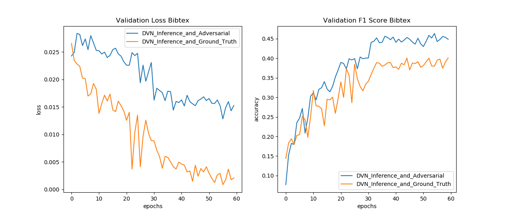

# Structured Prediction with Deep Value Networks
**Implementation in python with PyTorch.  
By Philippe Beardsell and Chih-Chao Hsu.**

### Implemented ###
* Structured Prediction Energy Networks (SPEN) (Belanger & McCallum 2015)  
(Implementation from David Belanger in Lua at https://github.com/davidBelanger/SPEN)   
Built SPEN for multi-label classification/ image segmentation and image tagging. 
* Deep Value Networks (Gygli & al. 2017) 
(Based on the TensorFlow implementation from the authors at https://github.com/gyglim/dvn)  
Built DVN for multi-label classification/ image segmentation and image tagging.
* Baseline models:
1. Feature network (SPEN):   Multi-layer perceptron that computes a feature representation
of the inputs for multi-label classification. 
2. Fully Convolutional Network (FCN) for Image Segmentation.
3. Unary model for image tagging: Pretrained AlexNet on ImageNet that was fine tuned on the MIRFLICKR25k dataset to make independent predictions for each tag of an image. Taken from the *Deep Structured Prediction with Nonlinear Output Transformations* paper(Graber & al 2018.)

### Reproducibility ###
#### Multi-label classification on  Bibtex ####
We could easily reproduce the authors' results with the DVN on Bibtex (F1 of 44.91% on the test set). We also achieved similar results for the SPEN model as the paper: a F1 Score of 41.6% on the test set, compared to 42.2% for the authors. 

F1 Score (%) on the Bibtex dataset (higher is better):

| Model              | Ours | Paper  |
| -------------------|:----:|:------:|
| MLP                | 38.9 | 38.9   |
| SPEN               | 41.6 | 42.2   |
| DVN + Ground Truth | 42.9 |  N/A   |
| DVN + Adversarial  | 44.9 | 44.7   |

#### Image segmentation on the Weizmann Horses dataset ####
Dataset available at https://avaminzhang.wordpress.com/2012/12/07/%E3%80%90dataset%E3%80%91weizmann-horses/
* IOU (%) on the Weizmann Horses dataset (higher is better):

| Model              | Ours | Paper  |
| -------------------|:----:|:------:|
| FCN                | 74.6   | 78.6   |
| SPEN               | 73 |  N/A   |
| DVN + Ground Truth | 76 |  76.7   |
| DVN + Adversarial  | 73 | 84.1   |

#### Image tagging on the MIRFLICKR25k dataset ####
Dataset available at http://press.liacs.nl/mirflickr/mirdownload.html   
We compare our results to the NLTop model from Deep Structured Prediction 
with Nonlinear Output Transformations from Graber & al. (2018). We didn't spend much time doing hyperparameter optimization
and trying different alternatives which might explain our poor results compared to a simple unary model trained
to make independent predictions for each label.
 
* Hamming Loss  on the validation set of the Flickr dataset (lower is better):

| Model              | Ours (10k training set) | Paper (10k training set)  | Ours (1k training set) |
| -------------------|:----:|:------:|:------:|
| Unary (Pretrained AlexNet)    | 2.16  | 2.18  | 2.69 |
| SPEN               | 2.24 |  N/A   | 2.51|
| DVN + Ground Truth | 2.22 |  N/A   | 2.47 |
| DVN + Adversarial  | 2.3 | N/A   | N/A |
| NLTop (Graber & al. 2018) | N/A | 1.98  | N/A |

